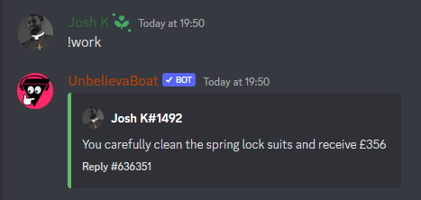

<div align="center">

# Auto Work

### A script to send a ```!work``` message to a discord channel periodically.



</div>

## Setup

1. Clone the repo with:

``` bash
git clone https://github.com/joshjkk/auto-work.git
```

2. Then fill out the values in [script.py](script.py) such as ```work_channel```, ```authorization``` and ```TIMEOUT``` according to channel ID, user token and bot command.

[See this video on how the script works and how to fill in the values.](https://www.youtube.com/watch?v=DArlLAq56Mo)

## Usage

In the command-line, run the script with:

``` bash
python3 script.py
```

### Notice

**USE AT YOUR OWN RISK**, THIS SOFTWARE MAY GET YOUR ACCOUNT **SUSPENDED**, **DEACTIVATED** OR EVEN WORSE **BANNED**. I AM **NOT RESPONSIBLE** FOR ANYTHING THAT OCCURS DUE TO YOUR USE OF THIS SOFTWARE AND BY DOWNLOADING THIS SCRIPT **YOU AGREE THAT ANYTHING THAT HAPPENS DUE TO THE SCRIPT IS YOUR ACTIONS AND THUS YOU ARE TO BLAME.**
